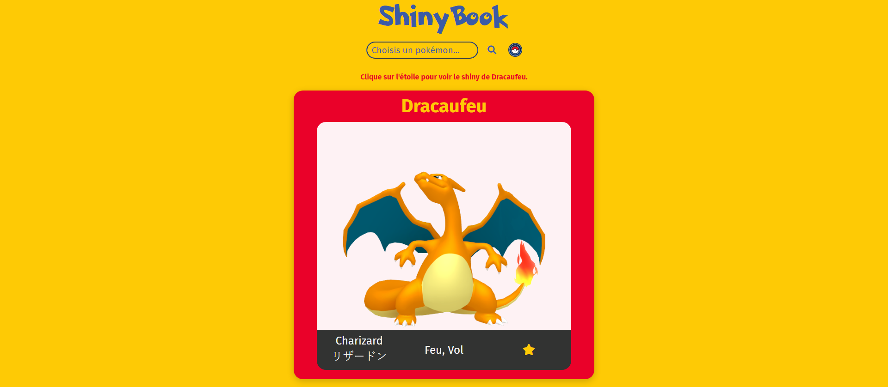

<h1 align="center"> ✨ ShinyBook ✨ </h1>

### 🌐 Demo / Preview



---

### ✏️ **Description**
ShinyBook is my second project utilizing API calls in front-end development. The concept was entirely my own, and I decided to create a **ShinyDex** – a tool allowing users to view the shiny version of any Pokémon.  

This project highlights the use of JavaScript to manage API calls and handle dynamic data. The HTML and CSS are minimal, as the focus was on functionality and mastering API-related techniques.

Perfect for all Pokémon fans!

### 💻 **Technologies Used**
- **HTML5**: Minimal structure for the application.
- **CSS3**: Basic styling (not heavily optimized).
- **JavaScript**: Main focus, used for API calls and dynamic content handling.

### **Key Features** 🚀
🎯 View shiny Pokémon: Fetch shiny versions of any Pokémon via API.

🔗 API integration: Mastery of API calls and dynamic data rendering.

💡 Custom concept: Created from scratch to serve Pokémon enthusiasts.

### 🛠️ **Installation & Usage**
1. Clone the repository:
   ```bash
   git clone https://github.com/HUYBERIC/ShinyBook.git
   cd ShinyBook
   ```

2. Open `index.html` in your favorite browser to use the ShinyDex.

<br>
<br>
<br>

---

<h1 align="center"> ✨ ShinyBook ✨ </h1>

---

### ✏️ **Description**
ShinyBook est mon deuxième projet utilisant des appels API en front-end. Le concept était entièrement libre, et j'ai décidé de créer un **ShinyDex** – un outil permettant d'observer la version Shiny de n'importe quel Pokémon.  

Ce projet met en avant l'utilisation de JavaScript pour gérer les appels API et les données dynamiques. Le HTML et le CSS sont réduits au minimum, car l'objectif principal était de se concentrer sur la fonctionnalité et la maîtrise des appels API.

Idéal pour tous les fans de Pokémon !

### 💻 **Technologies utilisées**
- **HTML5** : Structure minimale pour l'application.
- **CSS3** : Style de base (peu optimisé).
- **JavaScript** : Principalement utilisé pour les appels API et la gestion des contenus dynamiques.

### **Caractéristiques principales** 🚀
🎯 Visualisez les Pokémon Shiny : Récupérez la version Shiny de n'importe quel Pokémon via l'API.

🔗 Intégration API : Maîtrise des appels API et du rendu dynamique des données.

💡 Concept personnalisé : Créé de A à Z pour les passionnés de Pokémon.

### 🛠️ **Installation & Utilisation**
1. Cloner le dépôt :
   ```bash
   git clone https://github.com/HUYBERIC/ShinyBook.git
   cd ShinyBook
   ```

2. Ouvrir `index.html` dans votre navigateur favori pour utiliser le ShinyDex.
